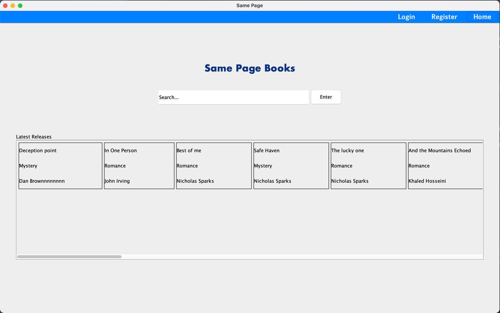
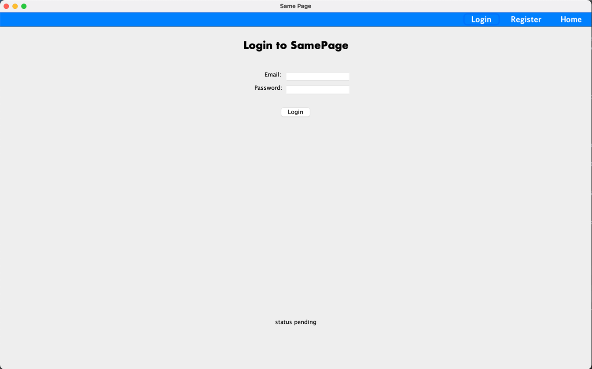
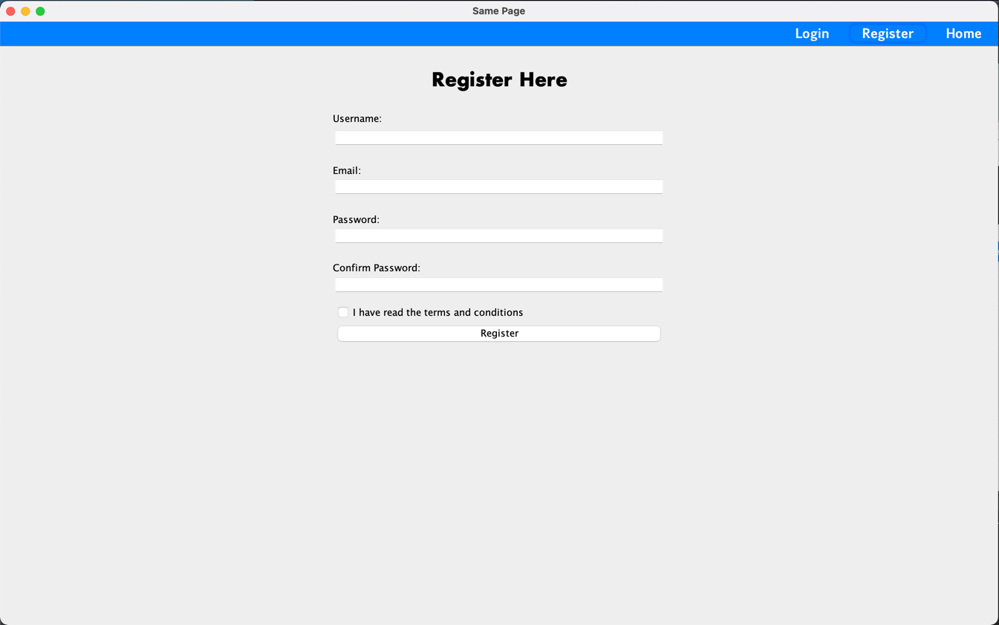

# EECS3311M-Project
Software Project for EECS3311

# ABOUT THIS PROJECT:

Same Page (SP) will be used to seek and maintain a community-based library of books that are personalized for each member.
Like a digital library, readers can search for, be recommended and learn more about their favorite books as well as view
the latest releases. Extra features that allow the reader's data to be stored will be available for those readers
registered as members with Same Page, including joining the same book clubs as other interested readers and tracking
reading progress.  

For the foreseeable future, the system is envisioned as a desktop application, however, it will be extensible so that
future releases can have a web and mobile interface.

# HOW IT WAS BUILT:

The functionality of the application is programmed entirely on java, and the GUI was created by using Java Swing
components. In the future iterations, a database will be added to store the book information and user profiles,
allowing SamePage to login and register users. This application follows SOLID principles, and utilizes the MVP design
architecture.

###### Landing Page


###### Login Page


###### Register Page


# BUILD LOCALLY
To build this project locally, you will need access to the database credentials. Please create a `config.properties` file
under the `resources` directory. Please reach out to your teammates for the respective credentials.
```shell
db.driver=${db.driver}
db.url=${db.url}
db.username=${username}
db.password=${password}
```

# Stub Data
If you want to run the application with stub data only, refer to src/main/java/com/eecs3311/persistence/Database.java and turn the stub data flag on: 
```shell
private static boolean isUsingStubDB = true;
```

# TESTING NOTES
You can either test with stub data only or test fully with a database, ensure you have a schema created refer to resources/data/samepageschema.sql
